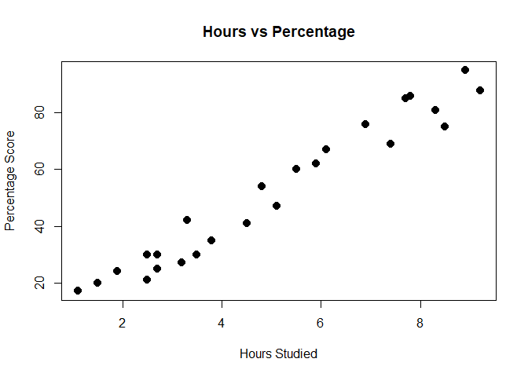

The Sparks-Foundation - Task 1
================
Sohom Das

The objective of this task is to predict the percentage of marks of an
student based on the number of study hours. This is a simple linear
regression task as it involves just two variables.

``` r
data_frame <- read.csv(url("http://bit.ly/w-data"))
```

Attach data\_frame and plot

``` r
attach(data_frame)
plot(Hours,Scores, main='Hours vs Percentage',xlab='Hours Studied',ylab='Percentage Score',cex=2,pch=20)
```

<!-- -->

Find correlation between predictor and response variables

``` r
cor(Hours,Scores)
```

    ## [1] 0.9761907

We see high correlation

Now we will fit a linear model

``` r
lmo <- lm(Scores~Hours, data=data_frame)
summary(lmo)
```

    ## 
    ## Call:
    ## lm(formula = Scores ~ Hours, data = data_frame)
    ## 
    ## Residuals:
    ##     Min      1Q  Median      3Q     Max 
    ## -10.578  -5.340   1.839   4.593   7.265 
    ## 
    ## Coefficients:
    ##             Estimate Std. Error t value Pr(>|t|)    
    ## (Intercept)   2.4837     2.5317   0.981    0.337    
    ## Hours         9.7758     0.4529  21.583   <2e-16 ***
    ## ---
    ## Signif. codes:  0 '***' 0.001 '**' 0.01 '*' 0.05 '.' 0.1 ' ' 1
    ## 
    ## Residual standard error: 5.603 on 23 degrees of freedom
    ## Multiple R-squared:  0.9529, Adjusted R-squared:  0.9509 
    ## F-statistic: 465.8 on 1 and 23 DF,  p-value: < 2.2e-16

Prediction

``` r
predict(lmo, data.frame(Hours = 9.25))
```

    ##        1 
    ## 92.90985

Therfore, the predicted score if a student studies for 9.25 hrs/day is
about 92.90.
